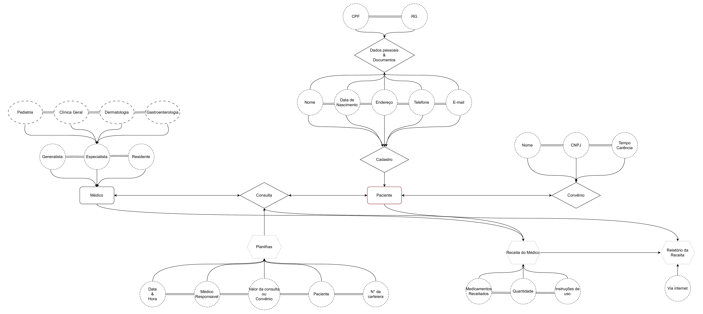
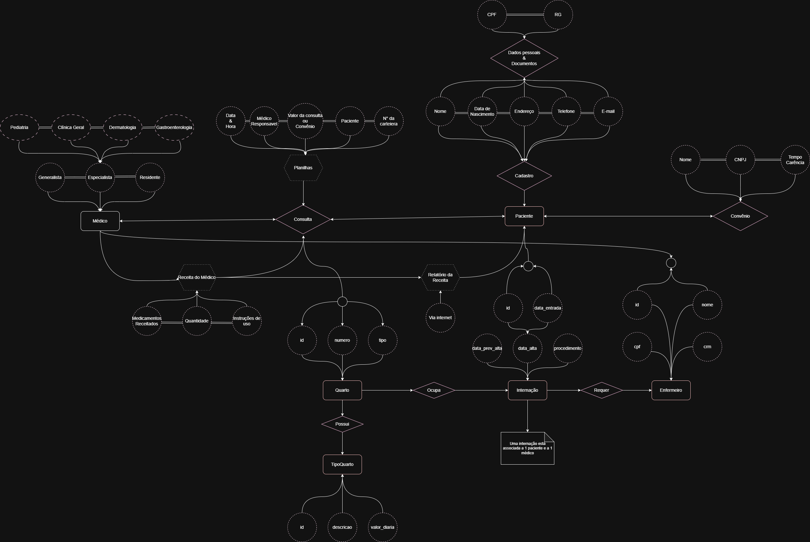
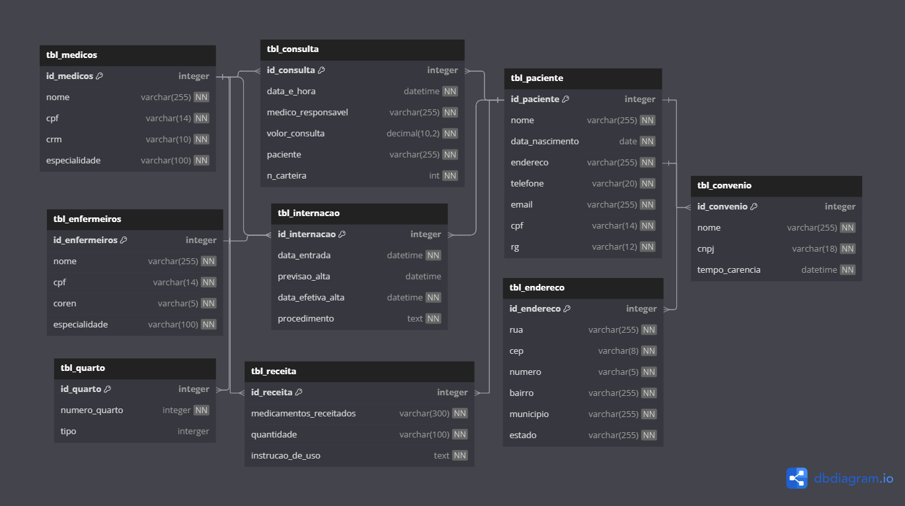

# 🏥 Sistema Hospitalar - Modelagem de Banco de Dados

> Projeto em duas etapas: **DER inicial** e **expansão para controle de internações**.

---

## 📌 Parte 1: Modelagem Inicial (DER)

### Contexto
Um hospital local precisa migrar dados de planilhas para um sistema novo. O objetivo era criar um **Diagrama Entidade-Relacionamento (DER)** que representasse suas necessidades básicas.

### Entidades Principais
- `Paciente`
- `Médico`
- `Consulta`
- `Departamento`

### Arquivos

---

## 🚑 Parte 2: Expansão para Internações

### Novos Requisitos
A segunda versão do sistema precisou incluir:
- Controle de **leitos** e **internações**
- Registro de **procedimentos** durante a internação
- Relação entre **equipe médica** e pacientes internados

### Modificações no Modelo
- Novas entidades: `Internacao`, `Leito`, `Procedimento`
- Relacionamentos atualizados: `Paciente <- Internacao -> Leito`

### Arquivos

---

---

## 🛠 Tecnologias Usadas
- DER: [draw.io](https://app.diagrams.net/)
- MER: [dbdiagram.io]()

---
